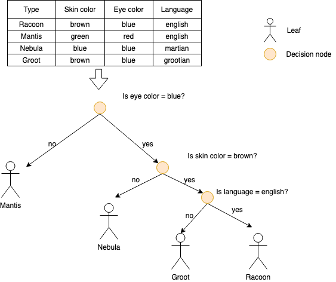
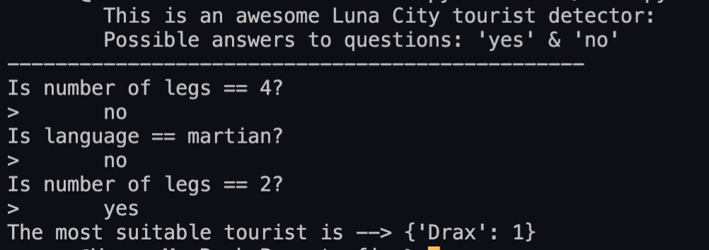

# Laboratory work no. 1

## Task:
- Research the types of tourists that visit Luna-City and collect a database of at least 5 tourist types and the criteria by which they can be distinguished from Loonies and between themselves (i.e. clothes, accent, gait, height and opinion on politics). After your database is done, create a system that would allow the user to answer some questions about a possible tourist. If the set of given answers matches a type of tourist from the database, this should be the system’s answer. If on the other hand, the system determines that the person in question is a Loonie, the answer should be returned accordingly. Make sure to consider the case when the set of answers does not find a match in the database (highly improbable if you’ve done your research well).

## Technologies and algorithms used

- Programming language: Python
- Algorithm: [Gini](https://medium.com/analytics-steps/understanding-the-gini-index-and-information-gain-in-decision-trees-ab4720518ba8)
 
## Algorithm
1. *Analyze initial data* 
   - Get distinct characteristics (from table)
2. *Process data*
   - From distinct characteristics is calculated the weight of the question
   - So, by gini algorithm is get the most important question
   - Get the `gain` from question
   - If last leaf - give answer if no process again

The main structure can be seen in the following image: 



## Folder structure
-  `main.py` - the main file, here starts the program
-  `data.py` - file containing data about tourists (like a small db)
-  `utils.py` - file with a bunch of helping methods
-  `tree.py` - basic utlis for tree, classes and methods


## Starting the program

- In order to start the program you just need to run 
```sh
 python3 main.py
```
A preview how program works can be seen in the following picture: 


